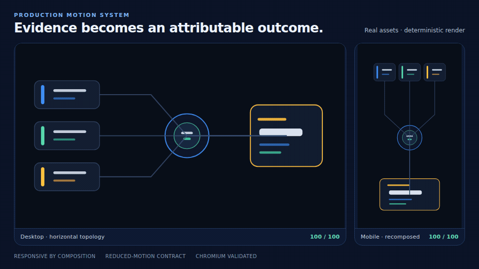

<p align="center">
  <strong>MOTIONPROOF</strong>
</p>

<h1 align="center">Motion that ships.</h1>

<p align="center">
  Prompt or recipe in. Certified Lottie, poster, preview, and proof out.<br />
  Built for humans, Claude Code, Codex, and any agent that can call a CLI or MCP tool.
</p>

<p align="center">
  <a href="https://github.com/HowdyDooToYou/lottie-animation-pipeline/actions/workflows/ci.yml"></a>
  <a href="LICENSE.md"></a>
  
</p>

<p align="center">
  <a href="https://motionproof.misty-myna-3764.chatgpt.site"><strong>Open the live studio →</strong></a>
  ·
  <a href="https://moreproof.dev/work/motionproof">Read the production proof →</a>
</p>

<p align="center">
  
</p>

MotionProof is a provider-neutral motion compiler. A model, coding agent, human, or
deterministic recipe may propose an animation. MotionProof decides whether it is
safe to ship.

It strictly validates the Lottie structure, renders nine representative frames
in Chromium, measures visible pixels and meaningful motion, captures a
reduced-motion poster, hashes every artifact, and atomically promotes the bundle.
Anything below the bar returns a structured failure instead of production files.

## Try it

From this repository:

```bash
npm install
npm run motionproof -- create \
  "A calm checkout success state" \
  --id checkout-success
```

After the npm package is published:

```bash
npx motionproof create \
  "A calm checkout success state" \
  --id checkout-success
```

The zero-key path uses a deterministic production recipe:

```text
motionproof-output/checkout-success/
├── animation.json       editable Lottie
├── poster.png           reduced-motion fallback
├── preview.html         portable offline review
├── certification.json   checks and raster evidence
└── manifest.json        hashes and provenance
```

Open `preview.html`. It contains its own player, respects
`prefers-reduced-motion`, and needs no server.

## Use it in code

```ts
import { createMotion } from "motionproof";

const result = await createMotion({
  prompt: "Show three agents routing evidence into one verified decision",
  preset: "technical",
}, {
  outputDirectory: "./public/motion",
});

if (!result.ok) {
  throw new Error(result.issues.map((issue) => issue.message).join("\n"));
}

console.log(result.artifacts);
```

The default provider requires no model and no API key. Bring any model through
one small interface:

```ts
import { createMotion, defineMotionProvider } from "motionproof";

const provider = defineMotionProvider(
  "my-studio-agent",
  async ({ systemPrompt, request, previousIssues }) => {
    return callMyModel({
      system: systemPrompt,
      prompt: request.prompt,
      feedback: previousIssues,
    });
  },
);

const result = await createMotion(
  { prompt: "A restrained save confirmation", maxAttempts: 3 },
  { provider },
);
```

Providers may return:

- a Lottie object;
- JSON text, including a fenced JSON block; or
- `{ animation, model?, recipe?, notes? }`.

Credentials, billing, and model SDKs stay in the host application. MotionProof owns
the stable request, certification, and artifact contracts.

## Use it from any agent

Machine-readable CLI:

```bash
npm run motionproof -- create "A system routing data into a decision" --json
```

Certify Lottie created by another agent:

```bash
npm run motionproof -- certify ./candidate.json \
  --prompt "A compact completion confirmation" \
  --json
```

Local MCP server:

```bash
npm run motionproof -- mcp
```

It exposes:

- `create_motion`
- `certify_motion`
- `list_motion_recipes`

The shared Agent Skill and both plugin manifests live in
[`plugins/motionproof`](plugins/motionproof):

```text
plugins/motionproof/
├── .claude-plugin/plugin.json
├── .codex-plugin/plugin.json
├── .mcp.json
├── bin/motionproof-mcp.cjs
└── skills/create-motion/SKILL.md
```

Claude Code can load the bundle directly during development:

```bash
claude --plugin-dir ./plugins/motionproof
```

The plugin launcher uses the repository or installed package locally when it is
available. A standalone marketplace installation falls back to the exact plugin
version of `motionproof` through npm—never an unpinned latest release.

The same open Agent Skill works in Codex, ChatGPT, Claude Code, and other hosts
that implement the Agent Skills standard. See
[`docs/agent-integration.md`](docs/agent-integration.md) for SDK, CLI, MCP, and
plugin details.

## The MotionProof contract

Designed. Deployable. Defensible.

| Gate | Required evidence |
| --- | --- |
| Strict structure | Lottie schema passes without automatic repair |
| Motion quality | Quality score is at least 85/100 |
| Visible rendering | Every representative sample paints pixels |
| Meaningful motion | At least three sampled transitions materially change |
| Delivery budget | Animation JSON is at most 500 kB |
| Reduced motion | A PNG poster is captured from the certified render |
| Atomic release | The complete bundle is promoted together or not at all |
| Provenance | SHA-256 hashes, provider, recipe, attempts, and prompt hash |

The model is a collaborator, never the quality authority.

Read the full contract in
[`docs/motionproof-contract.md`](docs/motionproof-contract.md).

## Built-in recipes

```bash
npm run motionproof -- recipes
```

| Recipe | Best for |
| --- | --- |
| `signal-flow` | Agents, data routing, pipelines, integrations |
| `success-seal` | Checkout, save, completion, confirmation |
| `milestone-bloom` | Launches, goals, progress, achievement |
| `executive-orbit` | Hero sections, platforms, ecosystems, ambient intelligence |

Recipes are deterministic, editable, themeable, and browser-certified. They
make the first run instant while custom model providers remain completely open.

## Product architecture

```text
prompt, recipe, or candidate JSON
                 │
                 ▼
          stable motion request
                 │
       ┌─────────┴─────────┐
       │ any provider      │ deterministic recipes
       └─────────┬─────────┘
                 ▼
       untrusted Lottie candidate
                 │
        strict + browser gates
                 │
       ┌─────────┴─────────┐
       │                   │
  structured failure   MotionProof bundle
```

The existing semantic motion specifications, responsive topology contracts,
runtime playback policy, and production Lottie builders remain available under
[`src/generator`](https://github.com/HowdyDooToYou/lottie-animation-pipeline/tree/master/src/generator).
MotionProof is the simpler public compiler surface over that proven engine.

## Development

```bash
npm run dev              # Product studio on http://localhost:3300
npm test                 # Unit + real Chromium tests
npm run build            # Studio + typed SDK + CLI
npm run check:production # Assets, tests, build, schema, browser rendering
npm run check:release    # Complete public release gate
```

Production builds write the npm SDK/CLI to `dist/` and the deployable product
studio to `studio-dist/`.

Coding agents entering the repository receive the same non-negotiable verifier
rules through [`AGENTS.md`](AGENTS.md) and [`CLAUDE.md`](CLAUDE.md).

Chrome or Chromium is required for certification. MotionProof auto-detects common
Linux, macOS, and Windows installations. Set `CHROMIUM_BIN` or pass
`--chromium <path>` when needed.

Chromium's sandbox remains enabled by default. Root-run containers automatically
receive the required no-sandbox flags; other containerized environments can set
`MOTIONPROOF_CHROMIUM_NO_SANDBOX=1` explicitly.

Node 22.12+ is supported.

## Open source, including commercial use

MotionProof Core is licensed under your choice of
[MIT or Apache-2.0](LICENSE.md). Use it in commercial production, client work,
products, hosted services, internal tools, and forks—no paid core license is
required.

The SDK, CLI, MCP server, Agent Skill, plugin bundles, deterministic recipes,
certifier, and local studio are all in the open core. If adoption earns it,
optional hosted capabilities, team controls, curated recipe packs, OEM help,
and support may follow as separate paid offerings. Released open-core rights do
not move backward. Read the plain-language [open-core boundary](OPEN_CORE.md).

Provider/API charges, provider terms, and rights in imported material remain
the operator's responsibility.

## Security and release integrity

- No provider credentials are required by the core package.
- The library does not inspect consumer CLI credentials.
- Provider errors are redacted before they enter structured results.
- Executable expressions, image/audio layers, external assets, and remote fonts
  are rejected before rendering.
- Certification uses the expression-free light player in a network-blocked
  Chromium page.
- Failed candidates never enter the output bundle.
- Dependency licensing, secrets, private paths, schema validity, and Chromium
  rendering are checked by `npm run check:release`.

See [SECURITY.md](SECURITY.md), [THIRD_PARTY_NOTICES.md](THIRD_PARTY_NOTICES.md),
[TRADEMARKS.md](TRADEMARKS.md), and
[the public release audit](docs/public-release-audit.md).
